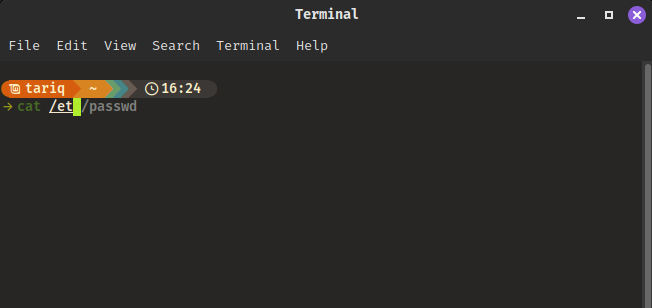
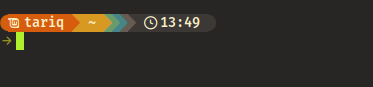
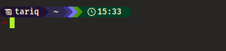
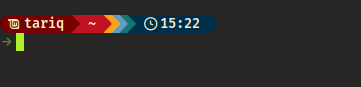

# Automated Zsh Environment Setup Script
### Overview
This script automates the installation and configuration of ZSH, including plugins, fonts, and the Starship prompt. It is designed for systems using APT or DNF package managers.



### Features
1. Installs and sets up ZSH as the default shell.
2. Configures ZSH plugins:
    - zsh-autosuggestions
    - zsh-syntax-highlighting
3. Adds FiraCode font for better terminal visuals.
4. Installs and configures the Starship prompt with predefined configuration files.
5. Cleans up temporary files after execution.
### Requirements
- Root privileges (use sudo to run the script).
- Compatible Linux distribution with either:
    - APT (e.g., Ubuntu, Debian)
    - DNF (e.g., Fedora, RHEL)
### Install
###### 1. Download and execute the script using the command below:

```bash
git clone https://github.com/Phoniness1/Better-Terminal.git && cd Better-Terminal && sudo bash zshInstall.sh && cd ..
```
##### 2. Pre-checks
- Verifies root privileges.
- Ensures /tmp directory exists.
###### 3. Post-Execution Steps
- Change the terminal font to FiraCode for optimal appearance.
    - In your terminal settings, go to Font Preferences and select FiraCode.
- Apply the changes by logging out and then signing in again.
## Details of the Script
### Components
- Dependencies: Installs zsh, wget, and tar if its not already installed.
- ZSH Configuration:
    - Moves any existing .zshrc to .zshrc.old for backup.
    - Copies a new preconfigured .zshrc configuration file.
### Plugins:
- Adds zsh-syntax-highlighting and zsh-autosuggestions plugins to /usr/share/ directory.
### FiraCode Font:
- Copies FiraCode fonts to the user’s ~/.fonts directory.
### Starship Prompt:
- Installs Starship and applies custom configurations from starship.toml, starship1.toml or starship2.toml. 
- The Starship theme can be changed by editing the .zshrc file and changing the line below.
```bash
export STARSHIP_CONFIG=~/.config/starship.toml
```
- Available options for Starship theming.
```bash
export STARSHIP_CONFIG=~/.config/starship.toml #default
```


```bash
export STARSHIP_CONFIG=~/.config/starship1.toml
```


```bash
export STARSHIP_CONFIG=~/.config/starship2.toml
```

## Functions
- preCheck: Checks for root privelages and ensures /tmp directory exists or is created.
- zshInstall: Installs ZSH and its dependencies.
- zshPlugins: Configures plugins for ZSH.
- firaCodeFonts: Adds FiraCode fonts (You will need to manually set FiraCode as your terminal font).
- starshipInstall: Installs and configures Starship.
- tmpClean: Cleans up temporary files.
### Error Handling
- The script ensures it is run as root. If not, it will exit with a message:
  
```text
This script must be run as root. Please use sudo.
```
- If a required package manager is missing, the script will fail gracefully. 
### License
This script is open-source and can be modified or distributed under the terms of the MIT License.

## Disclaimer
Use this script at your own risk. Ensure you understand the changes it makes to your system. Always back up important configurations before running automation scripts.
